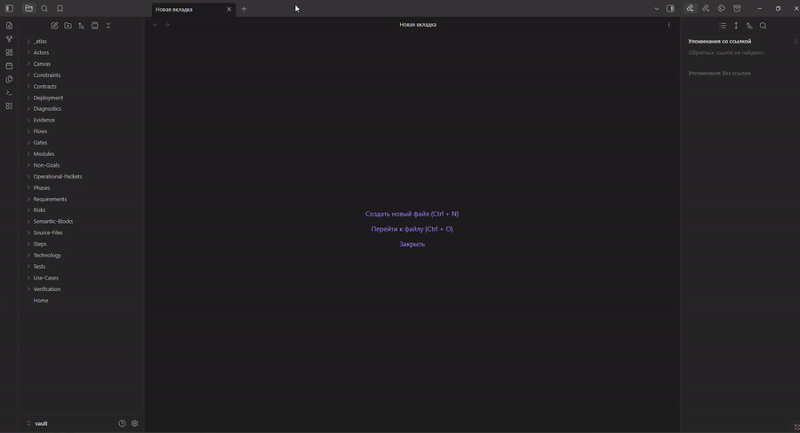
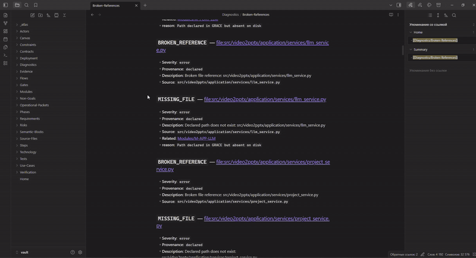

# GRACE Atlas

[](LICENSE)

Read-only tool that projects **real GRACE artifacts** and source markup into an **Obsidian Vault**.

GRACE XML and source code remain the source of truth. The vault is a disposable visualization layer.

**Repository:** https://github.com/kucheryavenkovn/grace-atlas  

Used as a **git submodule** in [video2pptx](https://github.com/kucheryavenkovn/video2pptx) under `tools/grace_atlas`, but works with any GRACE-governed project via config + discovery.

## What is GRACE?

**GRACE** = **G**raph-**R**AG **A**nchored **C**ode **E**ngineering — a contract-first methodology for AI-assisted engineering: semantic markup, shared XML artifacts (`requirements`, `development-plan`, `knowledge-graph`, `verification-plan`, …), verification planning, and knowledge-graph navigation.

Skills, marketplace packaging, and the optional `grace` CLI live here:

→ **[osovv/grace-marketplace](https://github.com/osovv/grace-marketplace)**

This repository (**grace-atlas**) is a separate, read-only **visualization** layer: it does not replace GRACE skills/CLI; it turns existing GRACE project artifacts into an Obsidian vault (Graph View, Local Graph, Canvas, diagnostics).

## GRACE graphs (Graphviz + Mermaid)

Standalone generator (stdlib + optional Graphviz `dot`) — **no Obsidian required**:

```powershell
# against any project with docs/*.xml (or XML in project root)
python tools/grace_graphs/generate_grace_graphs.py --project-root /path/to/grace-project

# Video2PPTX (when this repo is a submodule)
python tools/grace_atlas/tools/grace_graphs/generate_grace_graphs.py --project-root .
```

Writes under `<project>/docs/grace-graphs/` (or `--out`):

| Format | Path |
|--------|------|
| Graphviz DOT | `dot/*.dot` |
| SVG | `svg/*.svg` |
| PNG | `png/*.png` |
| Mermaid | `mermaid/*.mmd`, `mermaid/*.md` |

Example output from the minimal fixture: [`examples/grace-graphs/`](examples/grace-graphs/).

Details: [`tools/grace_graphs/README.md`](tools/grace_graphs/README.md).


## Demo

**Part 1** — артефакты GRACE (заметки vault, сгенерированные Atlas):



**Part 2** — глобальный граф Obsidian (Graph View, с 00:57):



<details>
<summary>Higher-quality MP4 (optional)</summary>

[demo-preview.mp4](docs/assets/demo-preview.mp4) — compressed H.264 preview of the full session.

</details>


## 1. Purpose

Give humans a visual interface to GRACE:

| View | What it is |
|------|------------|
| **Graph View** | Automatic “cloud” of all notes linked by `[[wiki-links]]` |
| **Local Graph** | Neighborhood of the note you have open |
| **Canvas** | Curated architecture / process boards (JSON Canvas) |
| **VS Code links** | Jump from a note to source at a line |
| **Diagnostics** | Traceability gap reports |

## 2. Read-only limitations (v1)

- Does **not** modify GRACE XML or application source  
- Does **not** update GRACE statuses or invent confirmed links  
- Does **not** require Obsidian plugins, embeddings, LLM, Neo4j, or network  
- Does **not** add a runtime dependency from Video2PPTX to Atlas  
- Inferred edges are labeled `inferred` and are **not** auto-confirmed  
- Canvas edits in Obsidian do **not** write back to GRACE  

## 3. Install

Python **3.10+**, **stdlib only** (no third-party runtime deps).

### Standalone

```powershell
git clone https://github.com/kucheryavenkovn/grace-atlas.git
cd grace-atlas
pip install -e ".[dev]"   # optional
python -m grace_atlas --help

# without install
$env:PYTHONPATH = "src"   # Linux/macOS: export PYTHONPATH=src
python -m grace_atlas --help
```

### As a git submodule (Video2PPTX and similar)

```powershell
git submodule add https://github.com/kucheryavenkovn/grace-atlas.git tools/grace_atlas
git submodule update --init --recursive

# clone host with submodule
git clone --recurse-submodules https://github.com/OWNER/HOST.git
```

Host projects usually keep `grace-atlas.toml` at the project root and a thin wrapper script.

## 4. Run

```powershell
# any GRACE project
python -m grace_atlas build --project-root /path/to/project

# Video2PPTX (submodule + wrapper)
python tools/grace_atlas.py build --project-root .

# Options
python -m grace_atlas build --project-root . --clean --output .grace-atlas/vault
python -m grace_atlas build --project-root . --open
python -m grace_atlas build --project-root . --strict
python -m grace_atlas status --project-root .
python -m grace_atlas trace M-APP-AUTO --project-root .
python -m grace_atlas open --project-root .
```

Default vault: `.grace-atlas/vault/` (override in `grace-atlas.toml` or `--output`).

## 5. Open the vault

1. Run `build`  
2. Obsidian → **Open folder as vault** → select `.grace-atlas/vault`  
3. Open `Home.md`  

If `open` / `obsidian://` fails, the CLI prints the absolute vault path — use that folder manually.

## 6. Global Graph View

1. Open the vault  
2. Click **Graph view** in the left ribbon (or command palette: “Graph view”)  
3. You should see a linked cloud of modules, use cases, files, verification, phases  

**Important:** relations are real `[[wiki-links]]` inside note bodies (not only frontmatter).  
`Home.md` intentionally does **not** link every entity (avoids a star graph).

### Filters and groups (manual in Obsidian)

- Filter: `tag:#grace/module`  
- Filter: `tag:#grace/file`  
- Filter: `tag:#grace/verification`  
- Filter: `tag:#grace/phase`  
- Filter: `path:Modules`  
- Exclude navigation clutter: `-tag:#grace/index` and optionally `-tag:#grace/home`  
- Color groups in Graph settings by tag (`grace/module`, `grace/file`, …)  

Atlas does **not** overwrite your personal `.obsidian/graph.json` after the first create.

## 7. Local Graph

1. Open any note (e.g. `Modules/M-APP-AUTO`)  
2. Command palette → **Open local graph**  
3. Increase **depth** in the Local Graph controls to see neighbors of neighbors  
4. Enable **arrows** in Graph settings if you want directed edges  

## 8. Canvas

Under `Canvas/`:

| File | Content |
|------|---------|
| `Project-Overview.canvas` | Core modules + deps sample + UC/V hubs |
| `Current-Phase.canvas` | Phase with `in_progress` (or diagnostic if unknown) |
| `User-Journey.canvas` | Install→…→state journey mapped to real UC/modules or **gap** |
| `Requirement-Traceability.canvas` | Columns UC / Module / File / V / Test / Evidence |
| `Verification-Gaps.canvas` | Gap clusters from diagnostics |

Cards reference Markdown notes (file nodes). Edge labels show relation types. Layout is deterministic.

**Important:** always open / link with the **`.canvas`** extension:

```markdown
[[Canvas/Project-Overview.canvas|Project Overview]]
```

A bare `[[Canvas/Project-Overview]]` makes Obsidian create an **empty** `Project-Overview.md`, which looks like a broken canvas. Rebuild removes those stubs.

Editing a Canvas does **not** change GRACE XML.

## 9. Jump to code (VS Code)

Notes include links like:

```text
vscode://file/C:/path/to/file.py:42:1
```

- Windows paths, spaces, and non-ASCII are URI-encoded  
- Line/column omitted when unknown (no fake `:1`)  
- Configure `vscode.enabled` in `grace-atlas.toml`  

## 10. Output structure

```text
.grace-atlas/vault/
├── .grace-atlas-generated      # safety marker
├── Home.md
├── Modules/  Use-Cases/  Verification/  Phases/  Steps/
├── Source-Files/  Tests/  Contracts/  Semantic-Blocks/
├── Technology/  Operational-Packets/  ...
├── Diagnostics/
│   ├── Summary.md
│   ├── Broken-References.md
│   ├── Orphan-Requirements.md
│   ├── Unverified-Modules.md
│   ├── Unmapped-Files.md
│   └── Ambiguous-Links.md
├── Canvas/
│   ├── Project-Overview.canvas
│   ├── Current-Phase.canvas
│   ├── User-Journey.canvas
│   ├── Requirement-Traceability.canvas
│   └── Verification-Gaps.canvas
└── _atlas/graph.json
```

Each entity note has:

- YAML frontmatter (`generated: true`, tags, grace_id, …)  
- Generated-file banner comment  
- Description, status, source artifact  
- Relationship sections with `[[TypeFolder/id]]` wiki-links (bidirectional at note level)  
- VS Code open links when paths exist  

## 11. Diagnostics

Provenance:

- **declared** — taken from GRACE XML / markup  
- **inferred** — heuristic (e.g. module→test via verification); not confirmed  
- **unresolved** — stub or missing target  

Reports live under `Diagnostics/`. CLI: `status`, `gaps`.

## 12. Safety

- Only writes under the configured vault path  
- Clean/replace requires marker `.grace-atlas-generated` (or empty dir / legacy marker)  
- Refuses project root, home, filesystem root  
- Writes to a temp directory then replaces the vault  

## 13. Tests

```powershell
$env:PYTHONPATH = "tools/grace_atlas/src"
python -m pytest tools/grace_atlas/tests -q
```

Includes fixture XML under `tests/fixtures/minimal/` and a smoke path against the real Video2PPTX docs.

## 14. Known limitations

- Product “requirements” are mostly **UseCases** (`UC-*`); no separate `FR-*` scheme in this repo  
- Operational packets XML is template-centric  
- CrossLink relations are free text → `cross_link` or mapped type  
- Large vaults: Semantic Blocks / Contracts increase node count  
- Graph layout in Obsidian is force-directed (not controlled by Atlas)  

## 15. Future ideas

- Optional write-back of human-approved links  
- Interactive filter presets shipped as optional Obsidian snippets  
- Incremental rebuild  
- Mermaid export  

## License

Same as the host repository.
