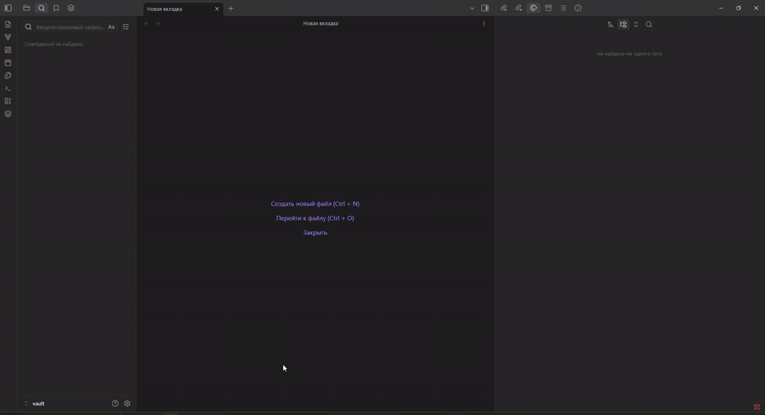
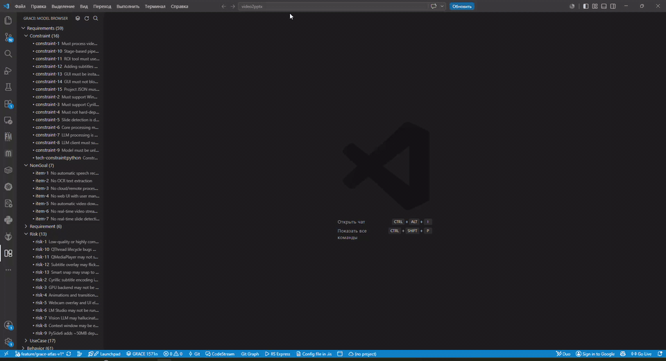

# GRACE Atlas

[](LICENSE)

**Язык:** [Русский](README.md) · [English](README.en.md)

Инструмент только для чтения: проецирует **реальные артефакты GRACE** и разметку исходников в **Obsidian Vault** и (с Phase 3) в **Workbench**-снимок для плагинов Obsidian / VS Code.

XML GRACE и исходный код остаются источником истины. Vault и snapshot — сменяемые слои визуализации.

**Репозиторий:** https://github.com/kucheryavenkovn/grace-atlas  

Используется как **git submodule** в [video2pptx](https://github.com/kucheryavenkovn/video2pptx) (`tools/grace_atlas`), но работает с любым GRACE-проектом через config + discovery.

## Что такое GRACE?

**GRACE** = **G**raph-**R**AG **A**nchored **C**ode **E**ngineering — contract-first методология AI-assisted разработки: семантическая разметка, общие XML-артефакты (`requirements`, `development-plan`, `knowledge-graph`, `verification-plan`, …), план верификации, навигация по knowledge graph.

Skills, marketplace и опциональный CLI `grace`:

→ **[osovv/grace-marketplace](https://github.com/osovv/grace-marketplace)**

Этот репозиторий (**grace-atlas**) — отдельный слой **визуализации** (read-only): не заменяет skills/CLI GRACE; превращает артефакты проекта в vault (Graph View, Local Graph, Canvas, diagnostics) и workbench snapshot.

## GRACE graphs (Graphviz + Mermaid)

Автономный генератор (stdlib + опционально Graphviz `dot`) — **Obsidian не нужен**:

```powershell
# любой проект с docs/*.xml (или XML в корне)
python tools/grace_graphs/generate_grace_graphs.py --project-root /path/to/grace-project

# Video2PPTX (когда репозиторий — submodule)
python tools/grace_atlas/tools/grace_graphs/generate_grace_graphs.py --project-root .
```

Пишет в `<project>/docs/grace-graphs/` (или `--out`):

| Формат | Путь |
|--------|------|
| Graphviz DOT | `dot/*.dot` |
| SVG | `svg/*.svg` |
| PNG | `png/*.png` |
| Mermaid | `mermaid/*.mmd`, `mermaid/*.md` |

Пример с минимальной фикстуры: [`examples/grace-graphs/`](examples/grace-graphs/).

Подробности: [`tools/grace_graphs/README.md`](tools/grace_graphs/README.md).

## Phase 3 — Workbench snapshot + плагины

```powershell
# 1) Vault + workbench snapshot
$env:PYTHONPATH = "src"   # или: pip install -e .
python -m grace_atlas build --project-root /path/to/project
# только snapshot:
python -m grace_atlas snapshot build --project-root /path/to/project

# 2a) Obsidian: открыть .grace-atlas/vault, поставить плагин из release zip
#     Команда: GRACE: Open Workbench

# 2b) VS Code: открыть корень проекта, поставить .vsix из release
#     Команда: GRACE: Open Workbench
```

Исходники: [`obsidian-plugin/`](obsidian-plugin/), [`vscode-extension/`](vscode-extension/).  
Демо-GIF — [ниже](#демо); сборки — [релиз v0.4.0](https://github.com/kucheryavenkovn/grace-atlas/releases/tag/v0.4.0).

## Phase 2 — Human workbench (Markdown / Bases)

После `build` откройте vault в Obsidian и начните с:

1. **[[Dashboards/Workbench]]** — главный вход (не глобальный Graph).
2. **Views/Requirements.base** — реестр UC/требований (plugin Bases).
3. Клик по строке → карточка → **Open local graph**.
4. Переходы: UC → VF → Module → Source → Tests.

Также: `Dashboards/Requirement-Tree`, `Traceability-Matrix`, `User-Journey-Video2PPTX`, `Diagnostics/Gaps-Registry`.

```powershell
python -m grace_atlas show UC-001 --project-root .
python -m grace_atlas open --project-root . --entity UC-001
```

## Демо

### Phase 3 — Workbench (Obsidian + VS Code)

Read-only оболочка в духе Rose поверх **нормализованного snapshot** (`.grace-atlas/model`), без разбора «сырого» GRACE XML в UI.

**Часть 1** — плагин Obsidian **GRACE Workbench** (Model Browser · Diagram · Inspector · Diagnostics):



**Часть 2** — расширение VS Code / Cursor (дерево + workbench на 4 панели, открытие исходника на строке):



Собранные плагины: [релиз v0.4.0](https://github.com/kucheryavenkovn/grace-atlas/releases/tag/v0.4.0)  
(`grace-workbench-obsidian-0.4.0.zip`, `grace-workbench-0.4.0.vsix`).

### Phase 1–2 — Vault / Graph View (legacy)

**Часть 1** — артефакты GRACE (заметки vault, сгенерированные Atlas):


**Часть 2** — глобальный граф Obsidian (Graph View, с 00:57):


<details>
<summary>MP4 более высокого качества (опционально)</summary>

[demo-preview.mp4](docs/assets/demo-preview.mp4) — сжатый H.264 preview более ранней сессии.

</details>

## 1. Назначение

Дать человеку визуальный интерфейс к GRACE:

| Представление | Что это |
|---------------|---------|
| **Graph View** | «Облако» заметок, связанных `[[wiki-links]]` |
| **Local Graph** | Окрестность открытой заметки |
| **Canvas** | Курируемые доски архитектуры / процессов (JSON Canvas) |
| **VS Code links** | Переход из заметки в исходник на строку |
| **Diagnostics** | Отчёты о разрывах трассируемости |
| **Workbench** | Rose-like UI (Obsidian / VS Code) поверх snapshot |

## 2. Ограничения read-only (v1 / workbench 3A)

- **Не** изменяет GRACE XML и исходники приложения (без GracePatch + подтверждения)  
- **Не** обновляет статусы GRACE и не подтверждает inferred-связи автоматически  
- **Не** требует embeddings, LLM, Neo4j или сети  
- **Не** добавляет runtime-зависимость Video2PPTX → Atlas  
- Inferred-рёбра помечены `inferred` и **не** auto-confirmed  
- Правки Canvas в Obsidian **не** пишутся обратно в GRACE  

## 3. Установка

Python **3.10+**, runtime-зависимости — **только stdlib**.

### Standalone

```powershell
git clone https://github.com/kucheryavenkovn/grace-atlas.git
cd grace-atlas
pip install -e ".[dev]"   # опционально
python -m grace_atlas --help

# без установки
$env:PYTHONPATH = "src"   # Linux/macOS: export PYTHONPATH=src
python -m grace_atlas --help
```

### Как git submodule

```powershell
git submodule add https://github.com/kucheryavenkovn/grace-atlas.git tools/grace_atlas
git submodule update --init --recursive

# клон хоста вместе с submodule
git clone --recurse-submodules https://github.com/OWNER/HOST.git
```

В корне хоста обычно лежат `grace-atlas.toml` и тонкий wrapper-скрипт.

## 4. Запуск

```powershell
# любой GRACE-проект
python -m grace_atlas build --project-root /path/to/project

# Video2PPTX (submodule + wrapper)
python tools/grace_atlas.py build --project-root .

# Опции
python -m grace_atlas build --project-root . --clean --output .grace-atlas/vault
python -m grace_atlas build --project-root . --open
python -m grace_atlas build --project-root . --strict
python -m grace_atlas status --project-root .
python -m grace_atlas trace M-APP-AUTO --project-root .
python -m grace_atlas open --project-root .
python -m grace_atlas snapshot build --project-root .
python -m grace_atlas impact UC-001 --project-root .
python -m grace_atlas drift --project-root .
```

Vault по умолчанию: `.grace-atlas/vault/` (override в `grace-atlas.toml` или `--output`).  
Snapshot: `.grace-atlas/model/`.

## 5. Открыть vault

1. Выполните `build`  
2. Obsidian → **Open folder as vault** → `.grace-atlas/vault`  
3. Откройте `Home.md`  

Если `open` / `obsidian://` не сработал, CLI печатает абсолютный путь vault — откройте папку вручную.

## 6. Глобальный Graph View

1. Откройте vault  
2. **Graph view** в ленте слева (или command palette)  
3. Должно появиться связанное облако modules / use cases / files / verification / phases  

**Важно:** связи — реальные `[[wiki-links]]` в теле заметок (не только frontmatter).  
`Home.md` **намеренно** не ссылается на каждую сущность (иначе «звезда»).

### Фильтры и группы (вручную в Obsidian)

- Filter: `tag:#grace/module`  
- Filter: `tag:#grace/file`  
- Filter: `tag:#grace/verification`  
- Filter: `tag:#grace/phase`  
- Filter: `path:Modules`  
- Убрать навигационный шум: `-tag:#grace/index`, опционально `-tag:#grace/home`  
- Цвета групп в Graph settings по tag (`grace/module`, `grace/file`, …)  

Atlas **не** перезаписывает ваш `.obsidian/graph.json` после первого создания.

## 7. Local Graph

1. Откройте заметку (например `Modules/M-APP-AUTO`)  
2. Command palette → **Open local graph**  
3. Увеличьте **depth**  
4. При желании включите **arrows** в настройках Graph  

## 8. Canvas

В `Canvas/`:

| Файл | Содержание |
|------|------------|
| `Project-Overview.canvas` | Ядро модулей + deps + UC/V |
| `Current-Phase.canvas` | Фаза `in_progress` (или diagnostic) |
| `User-Journey.canvas` | Journey → реальные UC/modules или **gap** |
| `Requirement-Traceability.canvas` | Колонки UC / Module / File / V / Test / Evidence |
| `Verification-Gaps.canvas` | Кластеры gaps из diagnostics |

Карточки ссылаются на Markdown. Подписи рёбер — типы отношений. Layout детерминированный.

**Важно:** всегда ссылайтесь с расширением **`.canvas`**:

```markdown
[[Canvas/Project-Overview.canvas|Project Overview]]
```

Голый `[[Canvas/Project-Overview]]` создаёт пустой `.md`. Rebuild убирает такие stubs.

Правка Canvas **не** меняет GRACE XML.

## 9. Переход в код (VS Code)

В заметках есть ссылки вида:

```text
vscode://file/C:/path/to/file.py:42:1
```

- Windows-пути, пробелы и non-ASCII кодируются  
- Строка/колонка опускаются, если неизвестны  
- Настройка: `vscode.enabled` в `grace-atlas.toml`  

Workbench-плагин VS Code открывает файлы из snapshot (`GRACE: Open Current Entity Source`).

## 10. Структура выхода

```text
.grace-atlas/
├── vault/                      # Obsidian vault
│   ├── .grace-atlas-generated
│   ├── Home.md
│   ├── Modules/  Use-Cases/  …
│   ├── Diagnostics/
│   ├── Canvas/
│   └── _atlas/graph.json
└── model/                      # Workbench snapshot (Phase 3)
    ├── manifest.json
    ├── model.json
    ├── diagnostics.json
    ├── indexes.json
    └── …
```

У заметки сущности: YAML frontmatter, баннер generated, описание, секции связей с `[[…]]`, VS Code-ссылки при наличии путей.

## 11. Diagnostics

Provenance:

- **declared** — из GRACE XML / markup  
- **inferred** — эвристика; не подтверждено  
- **unresolved** — stub или отсутствующая цель  

Отчёты: `Diagnostics/`. CLI: `status`, `gaps`.

## 12. Безопасность

- Пишет только в настроенный vault / `.grace-atlas/model` / user-данные  
- Clean vault требует маркер `.grace-atlas-generated` (или пустой каталог)  
- Отказ от записи в корень проекта, home, корень ФС  
- Атомарная замена через temp  

GracePatch (Phase 3C): plan → validate → `--confirm` → audit; без commit в git.

## 13. Тесты

```powershell
$env:PYTHONPATH = "src"   # из корня grace-atlas
python -m pytest tests -q
```

Фикстуры: `tests/fixtures/minimal/`; smoke — на реальных docs Video2PPTX.

## 14. Известные ограничения

- «Требования» в продукте в основном **UseCases** (`UC-*`); отдельной схемы `FR-*` может не быть  
- Operational packets часто template-centric  
- CrossLink — свободный текст → `cross_link` или mapped type  
- Большие vault: Semantic Blocks / Contracts увеличивают число узлов  
- Layout Graph View в Obsidian — force-directed (не управляется Atlas)  
- GUI workbench требует ручной acceptance (Obsidian / VS Code)  

## 15. Идеи на будущее

- Write-back только подтверждённых человеком связей  
- Пресеты фильтров Graph как optional snippets  
- Incremental rebuild  
- Полный GUI DnD / multi-tab polish  

## Лицензия

MIT (см. [LICENSE](LICENSE)). В submodule — та же политика, что у host-репозитория, если host переопределяет условия.
