# GRACE graphs (generated)

Source artifacts:

- `requirements`: `D:/git/video2pptx/tools/grace_atlas/tests/fixtures/minimal/requirements.xml` — **OK**
- `development_plan`: `D:/git/video2pptx/tools/grace_atlas/tests/fixtures/minimal/development-plan.xml` — **OK**
- `knowledge_graph`: `D:/git/video2pptx/tools/grace_atlas/tests/fixtures/minimal/knowledge-graph.xml` — **OK**
- `verification_plan`: `D:/git/video2pptx/tools/grace_atlas/tests/fixtures/minimal/verification-plan.xml` — **OK**
- `technology`: `D:/git/video2pptx/tools/grace_atlas/tests/fixtures/minimal/docs/technology.xml` — **MISSING**
- `operational_packets`: `D:/git/video2pptx/tools/grace_atlas/tests/fixtures/minimal/docs/operational-packets.xml` — **MISSING**

Modules: **4** · depends: **2** · V-M: **2** · UC: **2** · Phases: **2** · Steps: **2**

Regenerate (DOT + PNG + SVG + Mermaid):

```powershell
python tools/grace_graphs/generate_grace_graphs.py --project-root .
```

PNG/SVG require [Graphviz](https://graphviz.org/) (`dot` on PATH).

## Diagrams

### overview

- Graphviz DOT: [`dot/overview.dot`](dot/overview.dot)
- SVG: [`svg/overview.svg`](svg/overview.svg)
- PNG: [`png/overview.png`](png/overview.png)

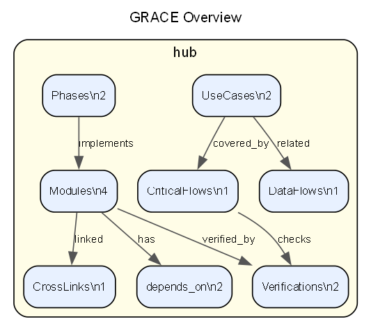

- Mermaid: [`mermaid/overview.mmd`](mermaid/overview.mmd)
- Mermaid (preview): [`mermaid/overview.md`](mermaid/overview.md)

**GRACE Overview** — nodes=8 edges=7

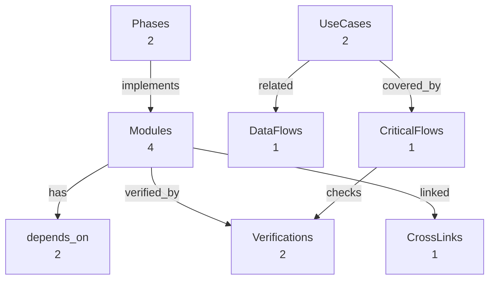

### modules-deps

- Graphviz DOT: [`dot/modules-deps.dot`](dot/modules-deps.dot)
- SVG: [`svg/modules-deps.svg`](svg/modules-deps.svg)
- PNG: [`png/modules-deps.png`](png/modules-deps.png)

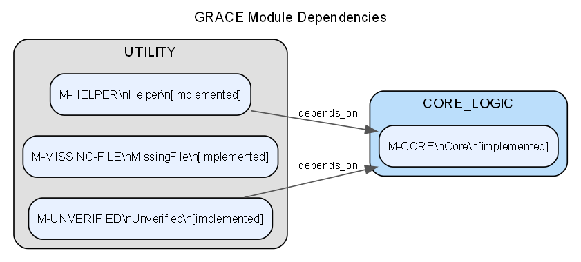

- Mermaid: [`mermaid/modules-deps.mmd`](mermaid/modules-deps.mmd)
- Mermaid (preview): [`mermaid/modules-deps.md`](mermaid/modules-deps.md)

**GRACE Module Dependencies** — nodes=4 edges=2

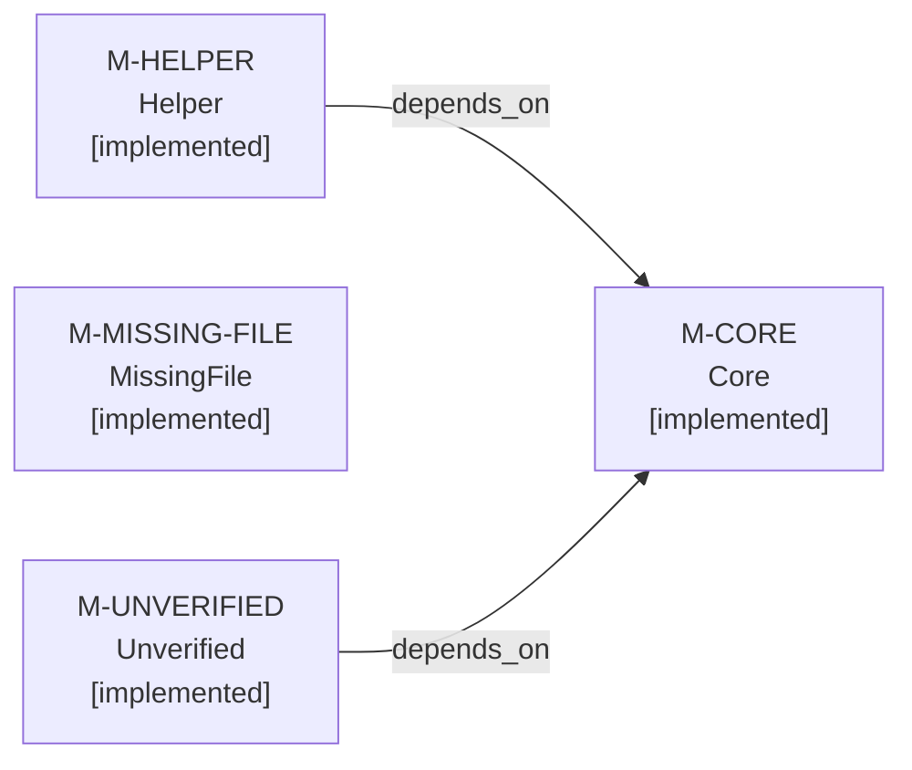

### modules-deps-core

- Graphviz DOT: [`dot/modules-deps-core.dot`](dot/modules-deps-core.dot)
- SVG: [`svg/modules-deps-core.svg`](svg/modules-deps-core.svg)
- PNG: [`png/modules-deps-core.png`](png/modules-deps-core.png)

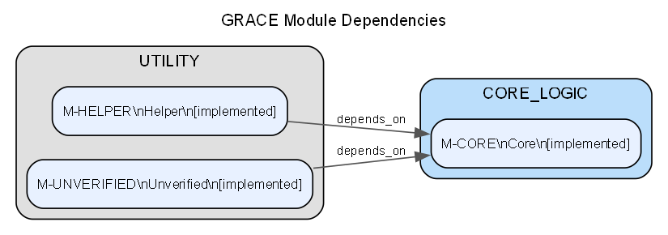

- Mermaid: [`mermaid/modules-deps-core.mmd`](mermaid/modules-deps-core.mmd)
- Mermaid (preview): [`mermaid/modules-deps-core.md`](mermaid/modules-deps-core.md)

**GRACE Module Dependencies** — nodes=3 edges=2

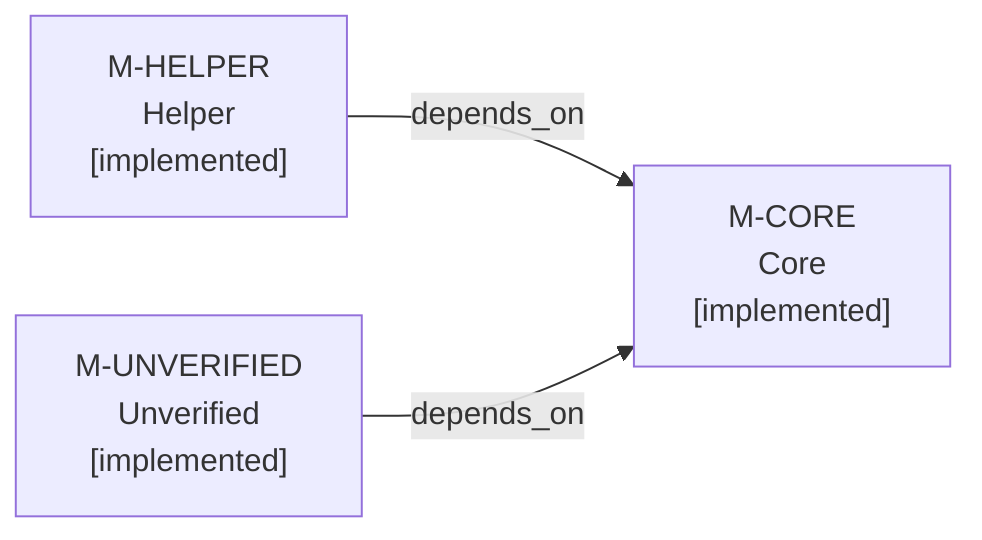

### modules-verification

- Graphviz DOT: [`dot/modules-verification.dot`](dot/modules-verification.dot)
- SVG: [`svg/modules-verification.svg`](svg/modules-verification.svg)
- PNG: [`png/modules-verification.png`](png/modules-verification.png)

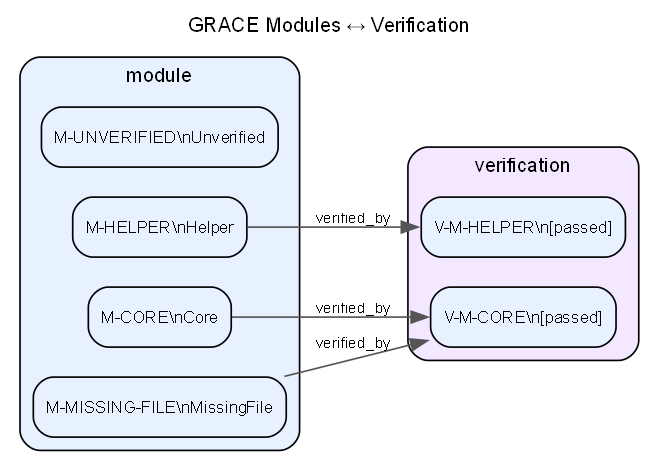

- Mermaid: [`mermaid/modules-verification.mmd`](mermaid/modules-verification.mmd)
- Mermaid (preview): [`mermaid/modules-verification.md`](mermaid/modules-verification.md)

**GRACE Modules ↔ Verification** — nodes=6 edges=3

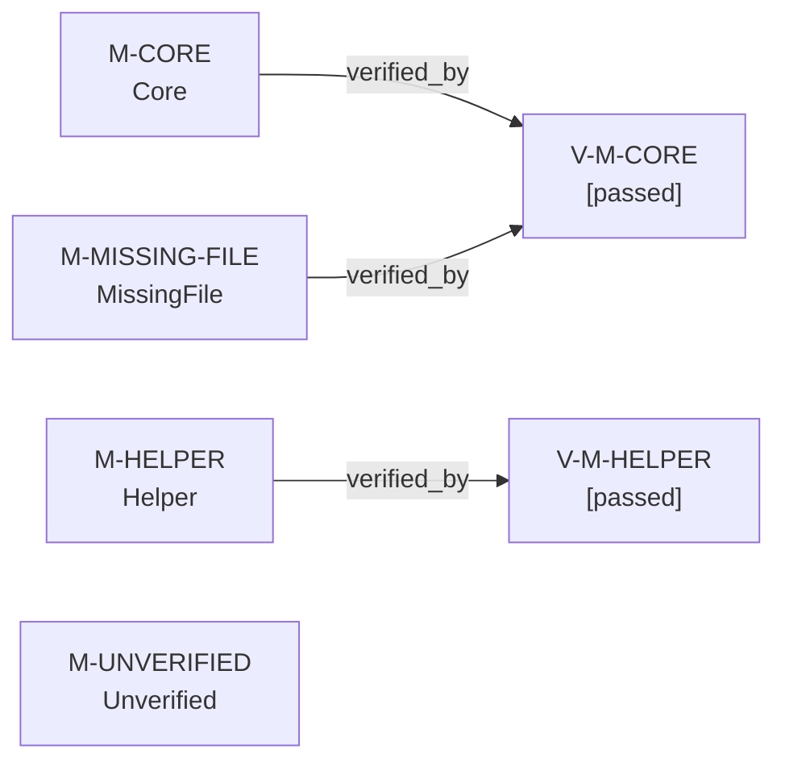

### use-cases-flows

- Graphviz DOT: [`dot/use-cases-flows.dot`](dot/use-cases-flows.dot)
- SVG: [`svg/use-cases-flows.svg`](svg/use-cases-flows.svg)
- PNG: [`png/use-cases-flows.png`](png/use-cases-flows.png)

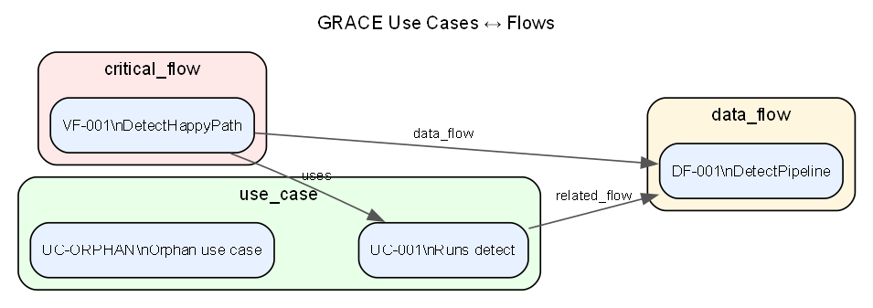

- Mermaid: [`mermaid/use-cases-flows.mmd`](mermaid/use-cases-flows.mmd)
- Mermaid (preview): [`mermaid/use-cases-flows.md`](mermaid/use-cases-flows.md)

**GRACE Use Cases ↔ Flows** — nodes=4 edges=3

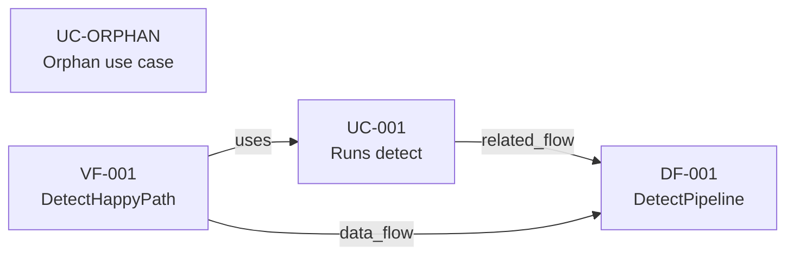

### phases-steps

- Graphviz DOT: [`dot/phases-steps.dot`](dot/phases-steps.dot)
- SVG: [`svg/phases-steps.svg`](svg/phases-steps.svg)
- PNG: [`png/phases-steps.png`](png/phases-steps.png)

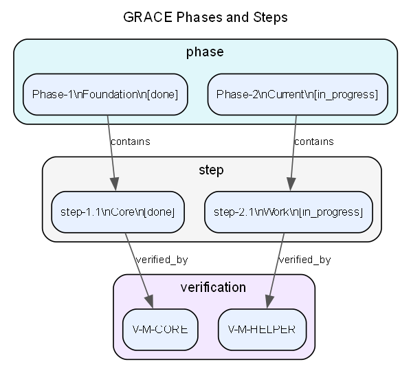

- Mermaid: [`mermaid/phases-steps.mmd`](mermaid/phases-steps.mmd)
- Mermaid (preview): [`mermaid/phases-steps.md`](mermaid/phases-steps.md)

**GRACE Phases and Steps** — nodes=6 edges=4

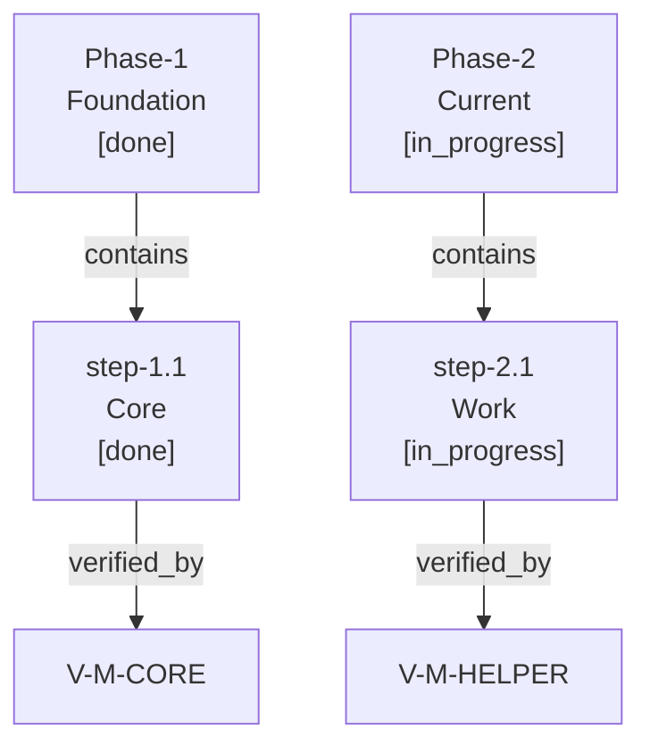

### cross-links

- Graphviz DOT: [`dot/cross-links.dot`](dot/cross-links.dot)
- SVG: [`svg/cross-links.svg`](svg/cross-links.svg)
- PNG: [`png/cross-links.png`](png/cross-links.png)

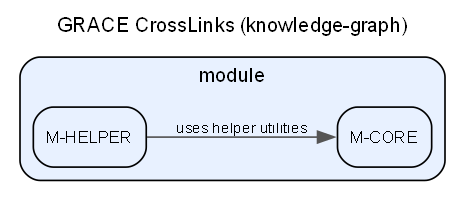

- Mermaid: [`mermaid/cross-links.mmd`](mermaid/cross-links.mmd)
- Mermaid (preview): [`mermaid/cross-links.md`](mermaid/cross-links.md)

**GRACE CrossLinks (knowledge-graph)** — nodes=2 edges=1


