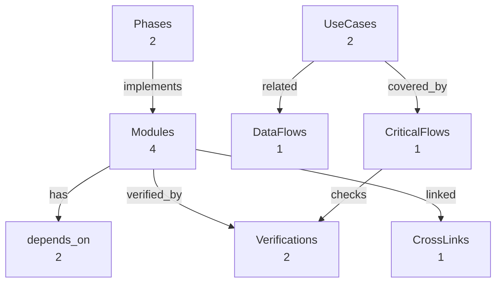

# GRACE Overview

```mermaid
%% GRACE Overview
flowchart TB
  CriticalFlows["CriticalFlows<br/>1"]
  CrossLinks["CrossLinks<br/>1"]
  DataFlows["DataFlows<br/>1"]
  DependsEdges["depends_on<br/>2"]
  Modules["Modules<br/>4"]
  Phases["Phases<br/>2"]
  UseCases["UseCases<br/>2"]
  Verifications["Verifications<br/>2"]

  Modules -->|has| DependsEdges
  Modules -->|verified_by| Verifications
  Modules -->|linked| CrossLinks
  UseCases -->|related| DataFlows
  UseCases -->|covered_by| CriticalFlows
  Phases -->|implements| Modules
  CriticalFlows -->|checks| Verifications
```
